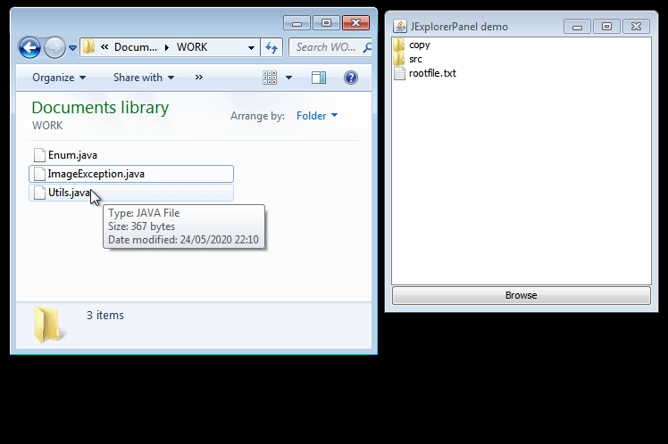

# JExplorerTree 
Component for file management, with basic operations and DnD support



## Features

It was designed to be used in the context of a specific project directory (Workspace). It is not designed to browse the file system entirely.

- Lazy load (only when it expands)
- No extra dependencies (extends JPanel and use a JTree)
- External Drag and Drop (from and to OS)
- Internal Drag and Drop (inside tree)
- Keyboard Support: F2, DELETE, ENTER
- CTRL+C, CTRL+V, CTRL+X (internal)
- CTRL+V (from external Files)
- CTRL+C (allow copy form JTree to external)
- React at external changes (grayout)
- Native Icons Support 
- Basic operations  
  - New File
  - New Directory
  - Rename
  - Refresh (sync external changes.)
  - Multi-File Copy / Delete
  - Copy / Move Directory (see #1)
  - Delete (with UNDO)


## Methods to overwrite

- **JExplorerPanel.log(String)** - plug your log system
- **JExplorerPanel.tr(String)** - translate messages.
- **JExplorerPanel.showExeption | showXXX** - handle user messages.
- **JExplorerPanel.handleOpenFile** - called by DOUBLE-CLICK and ENTER
- **JExplorerPanel.handleXXXXX** - user operations.
- **JExplorerPanel.configureTree** - configure what you think is necessary.
- **JExplorerPanel.configureMenu** - configure what you think is necessary


## Usage

```java
JExplorerPanel fileExplorerPanel = new JExplorerPanel(new File(root));
jframe.add(fileExplorerPanel, BorderLayout.CENTER);
```

See: [example](src/examples/FileExplorerPanelDemo.java)

Customize menus (override initMenus):

```java
  @Override
  protected void initMenus() {
    super.initMenus();
    popup.remove(0); // remove frist menu Add File
  }
```

## TODO / Tests

Waiting for contributions to complement these features. ;)

- [ ] Redo (after UNDO)
- [ ] New File / Dir, has no UNDO (very easy to implement)
- [x] Detect external changes e update root (only if another operation forces the reload)
- [ ] Test real use-case translation.
- Subdirectory
- [x] Move with files
- [x] Move with subfolders #1
- [x] Copy with files
- [x] Copy with subfolders #1
- [ ] Copy/Move, file already exists in target dir (show message) (done.. OVERRIDE BY DEFAULT)
- Undo
- [x] UNDO with files
- [x] UNDO directory with files
- [x] UNDO directory with subfolders
- [x] UNDO (/tmp folder in another partition)
- [ ] Undo / Delete - Files from diferent paths #2


## Build

The project uses maven for its construction. To obtain the JAR, run:

```
mvn clean package
```

You can use simple provided example:
JExplorerTree/src/examples/FileExplorerPanelDemo.java  
`java -jar target/jexplorertree-0.0.1-SNAPSHOT.jar`

## Projects Using:

- https://github.com/ricardojlrufino/Arduino

Add your project here !


## Undo

The undo operation is limited to **5 actions**, as it is difficult to maintain consistency .. needing further tests to fully validate.

### Undo DELETE

Basically the delete operation creates a temporary folder, and moves the deleted files there.

PS: Lack of testing on MacOS and Windows 10

```
ls /tmp/jfileexpl*
/tmp/jfileexplorer15903530670858895378310641893057:
package.html*

```


